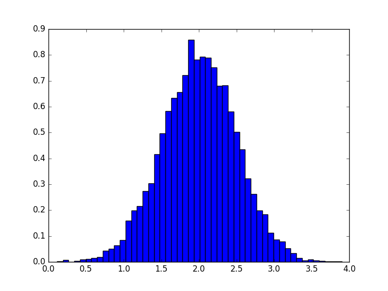

# What is Python

## Python is ... 

<div class='centered'>
Python is a widely used <span style="color:red">high-level</span> programming language for <span style="color:red">general-purpose</span> programming
</div>

* It automates areas of computing for the user
* includes natural language elements to be easier to use
* It is not designed with a specific domain in mind

## History

Python was created by *Guido van Rossum* at the "National Research Institute for Mathematics and Computer Science" (The Netherlands)

**Core Philosophy:**

* Beautiful is better than ugly
* Explicit is better than implicit
* Simple is better than complex
* Complex is better than complicated
* Readability counts

> A small core language with a large standard library and an easily extensible interpreter.

## Hello World

```{python}
x = 'hello, python world!'
print(x)
```

**What is happening here?**

```python
x = 'hello, python world!'
```

* we assign a *string* to the variable *x*

```python
print(x) 
print x #python 2.7
```

* we print *x*

# Syntax and Semantics

##  Basics

The main focus of python is **readability**.

* there are no semicolons at the end of a line (line in C/C++)
* English keywords are used extensively 
* Python does not use curly brackets "{}"
* Python has fewer syntactic exceptions


## Indentation

Python uses **whitespace** indentation to delimit blocks of code and **not** curly brackets

```python
def foo(x):
    if x == 0:
        bar()
    else:
        qux(x)
```

```cpp
void foo(int x)
{
    if (x == 0) {
        bar();
    } else {
        qux(x);
    }
}
```

## Statements and control flow

**Assignment Statement:**

```python
x = 2
```

* "typed variable name x receives a copy of numeric value 2"
* python does the rest for you (memory allocation, dynamic typing)


## If statements and Functions

**If statement**

```python
if x == 2:
    bar()
else:
    foo()
```

**Functions**

```{python}
# define function
def foo(x):
    return(x + 1)

# execute function
z = foo(2); print(z)
```

# Expressions

## Simple Math

**Addition and Subtraction**

```{python}
x = 2; y = 4
print(x + y); print(x - y)
```

**Multiplication**
```{python}
x = 2; y = 4
print(x * y); print(x**y); print(x/y)
```

## Danger with previous Python versions

Previous versions of Python used the classic division also used in other programming languages.
For example
```python
7 / 3 == 2 #python <= 2.1
-7 / 3 == -2 #python <= 2.1

7 / 3 == 2 #python  2.2
-7 / 3 == -3 #python  2.2
```

* Python 2.1 and earlier use C division behavior (integer division rounds towards 0)
* Python 2.2 changed the rounding towards negative infinity
* Python 3 and younger changed `/` to be always a float-point devision

```python
7/2 == 3.5
```

## Other assignment operators

```{python}
x = 1
x += 1
print(x)
```

```{python}
x = 1
x -= 1
print(x)
```

```{python}
x = 1
x /= 2
print(x)
```

## Other operators

```{python}
x = 1; y = 2
print(x == y)
print(x != y)
print(x > y)
print(x < y)
print(x <= y)
```

# Types

## Numeric and String Types

**Numeric**
```python
x = 42 # int
x = 42.5 # float
x = 3+2.7j # complex (with real and imaginary part)
```

**String**
```python
x = 'Wikipedia'
x = "Wikipedia"
x = """Spanning
multiple
lines"""
```

There are also other types such as `bytearray` and `bytes`.

# Lists, Tubles, and Dicts

## Lists

* can contain mixed types
* index starts at 0

```{python}
list1 = ['Hello', 'Foo', 'Python', 'Gene']
print("list1[0]: ", list1[0])
print("list1[0:3]: ", list1[0:3])
```

```{python}
list1 = ['Hello', 'Foo', 'Python', 'Gene']
print("list1[0]: ", list1[0])
list1[0] = 'Goodbye'
print("list1[0]: ", list1[0])
```

## Basic List operations

```{python}
print(len([1,2,3]))
```

```{python}
print([1,2,3] + [1,2,3])
```

```{python}
print(['Hi!'] * 4)
```

```{python}
print(3 in [1,2,3])
```

## The For loop

```{python}

for x in [1,2,3]:
    print(x**2)
```

```{python}
for i, item in enumerate([9,12,24]):
    print("Index %i has the value %i" % (i, item))
```

## Methods

> A method is a function that “belongs to” an object.

```{python}
x = [0,1,2,3]; x.append(4)
print(x)
```

```{python}
x = [1,1,2,3]
print(x.count(1))
```

```{python}
x = [6,1,2,4]
x.sort(); print(x)
```

## Tubles

Tubles are like lists, but **cannot** be changed

```{python}
tup1 = (12, 34.56);
tup2 = ('abc', 'xyz');

# Following action is not valid for tuples
# tup1[0] = 100;

tup3 = tup1 + tup2;
print(tup3)
```

## Dicts

Essentially a list with keys

```{python}
dict = {'Name': 'Zara', 'Age': 7, 'Class': 'First'}
print("dict['Name']: ", dict['Name'])
dict['Age'] = 8
print("dict['Age']: ", dict['Age'])
```

```{python}
dict = {'Name': 'Zara', 'Age': 7, 'Class': 'First'}
del dict['Name']; # remove entry with key 'Name'
dict.clear();     # remove all entries in dict
del dict ;        # delete entire dictionary
```

## Dicts

```{python}
dict = {'Name': 'Zara', 'Age': 7, 'Name': 'Manni'}
print("dict['Name']: ", dict['Name'])
```

```{python}
dict = {'Name': 'Zara', 'Age': 7, 'Class': 'First'}
for key, value in dict.items():
    print(key, value)
```

**don't assume that the keys will be in any particular order**

# Data Analysis with Python

## NumPy

Adds support to python for

* large, multi-dimensional array and amtrices
* various high level mathematical functions
* missing values

```{python}
import numpy as np
x = np.array([0,1,2,3])
print(x)
print(x*2)
```

## More Complex Arrays

```{python}
import numpy as np
x = np.arange(15).reshape(3,5)
print(x)
```


```{python}
import numpy as np
x = np.ones((2,3))
print(x)
```

## Multidimensional 

```{python}
import numpy as np
x = np.ones((2,3,4))
print(x)
```

## Some other functions

```{python}
import numpy as np
x = np.linspace(0, 2*np.pi, 20)
f = np.sin(x)
print(f)
print(f < 0)
```

## Matrix Algebra

```{python}
import numpy as np
A = np.array([[0,1],[1,0]])
B = np.array([[2,1],[4,5]])
print("A*B operation:\n", A*B)
print("A.dot(B) operation:\n",A.dot(B))
print("np.dot(A,B) operation:\n",np.dot(A,B))
```

## Some more

```{python}
import numpy as np
A = np.array([[0,1],[1,0]])
B = np.array([[2,1],[4,5]])
print("Inverse:\n",np.linalg.inv(A))
print("Eigenvalues:\n",np.linalg.eig(A))
```

and so many others

## Combination With Other Packages

```python
import numpy as np
import matplotlib.pyplot as plt
mu, sigma = 2, 0.5
v = np.random.normal(mu,sigma,10000)
plt.hist(v, bins=50, normed=1)
plt.show() # plt.savefig("hist.png") 
```


## Missing values

```{python}
import numpy as np
x = np.array([1,2,3,4,np.nan])
print("np.sum(x): ", np.sum(x))
print("np.nansum(x): ", np.nansum(x))
print("or: ", np.sum(x[~np.isnan(x)]))
```

# Pandas - A dataframe in Python

## Pandas -- Introduction

Pandas is a high-performance, easy-to-use data structures and data analysis tools

```{python}
import pandas as pd
import numpy as np
s = pd.DataFrame([1,3,5,np.nan,6,8])
print(s)
```

## Something more complicated

```{python}
import pandas as pd
import numpy as np
df = pd.DataFrame({ 'A' : 1.,
                     'B' : pd.Timestamp('20130102'),
                     'C' : pd.Series(1,index=list(range(4)),dtype='float32'),
                     'D' : np.array([3] * 4,dtype='int32'),
                     'E' : pd.Categorical(["test","train","test","train"]),
                     'F' : 'foo' })
print(df)
```


## Basic DataFrame Manipulation

```{python}
import pandas as pd
import numpy as np
df = pd.DataFrame(np.random.randn(6,4), columns=list('ABCD'))
print(df.describe())
```

## Sorting

```{python}
import pandas as pd
import numpy as np
df = pd.DataFrame(np.random.randn(6,4), columns=list('ABCD'))
print(df.sort_values(by='B'))
```

## Selecting

```{python}
import pandas as pd
import numpy as np
df = pd.DataFrame(np.random.randn(6,4), columns=list('ABCD'))
print(df.loc[:,['A','B']])
```

## Selecting

```{python}
import pandas as pd
import numpy as np
df = pd.DataFrame(np.random.randn(6,4), columns=list('ABCD'))
print(df[df > 0])
```

## Some Stats

```{python}
import pandas as pd
import numpy as np
df = pd.DataFrame(np.random.randn(6,4), columns=list('ABCD'))
print(df.mean())
print(df.apply(lambda x: x.max() - x.min()))
```

## Grouping

```{python}
import pandas as pd
import numpy as np
df = pd.DataFrame({'A' : ['foo', 'bar', 'foo', 'bar',
                          'foo', 'bar', 'foo', 'foo'],
                   'B' : ['one', 'one', 'two', 'three',
                          'two', 'two', 'one', 'three'],
                   'C' : np.random.randn(8),
                   'D' : np.random.randn(8)})
print(df.groupby('A').sum())
```

## Other Packages

There are a number of other commonly used python packages

* scipy -  collection of scientific functions
* IPython - interactive python platform
* nose - testing environment
* seaboard -  plotting
* TensorFlow - machine learning

# Python in Genetics

## PyVCF

```{python}
import vcf
vcf_reader = vcf.Reader(open('example-4.0.vcf', 'r'))
for record in vcf_reader:
    print(record)
```

## PyVCF

```{python}
import vcf
vcf_reader = vcf.Reader(open('example-4.0.vcf', 'r'))
record = next(vcf_reader)
print(record.genotype('NA00001')['GT'])
for sample in record.samples:
    print(sample['GT'])
```

## Some Others

* DEAP: An evolutionary algorithm framework for rapid computation
* Connor: Command-line tool to deduplicate reads in bam files based on custom inline barcoding.
* Pyvolution: Extensible evolutionary algorithms framework
* LD-Score: Estimating heritability and genetic correlation from GWAS summary statistics
* and so many others

# Quiz

## The URL

[kahoot.it](kahoot.it)
